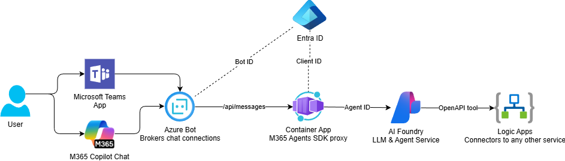
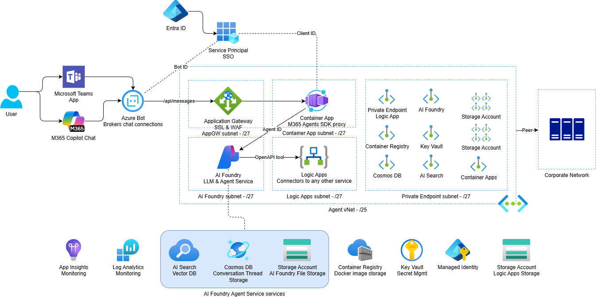

# M365 Agents SDK – AI Foundry Wrapper

## Logical Architecture



## Physical Architecture



This repository provisions a secure, private Azure landing zone (Storage, Cosmos DB, AI Search, AI Foundry, Logic App Standard, Container Apps, ACR) for building agent-powered Microsoft 365 integrations. All resources are deployed with network isolation (private endpoints + VNet integration) and least-privilege identities.

## Disclaimer

**THE SOFTWARE IS PROVIDED "AS IS", WITHOUT WARRANTY OF ANY KIND, EXPRESS OR IMPLIED, INCLUDING BUT NOT LIMITED TO THE WARRANTIES OF MERCHANTABILITY, FITNESS FOR A PARTICULAR PURPOSE AND NONINFRINGEMENT. IN NO EVENT SHALL THE AUTHORS OR COPYRIGHT HOLDERS BE LIABLE FOR ANY CLAIM, DAMAGES OR OTHER LIABILITY, WHETHER IN AN ACTION OF CONTRACT, TORT OR OTHERWISE, ARISING FROM, OUT OF OR IN CONNECTION WITH THE SOFTWARE OR THE USE OR OTHER DEALINGS IN THE SOFTWARE.**

## Deployment Overview

This solution is deployed in stages. Each stage is idempotent; infrastructure changes flow through Terraform only.

| Step | Description                                      | Documentation                                                  |
| ---- | ------------------------------------------------ | -------------------------------------------------------------- |
| 0    | Configure App Registration & DNS/SSL Certificate | [Prerequisites](docs/prerequisites.md)                         |
| 1    | Deploy Azure Infrastructure with Terraform       | [Infrastructure Deployment](docs/infrastructure-deployment.md) |
| 2    | Deploy Logic App & AI Foundry Agent              | [Logic App Deployment](docs/logic-app-deployment.md)           |
| 3    | Build & Deploy M365 Agents Container             | [Container Deployment](docs/container-deployment.md)           |
| 4    | Configure Application Gateway & Public Access    | [Application Gateway](docs/application-gateway.md)             |
| 5    | Deploy Teams App Package                         | [Teams Deployment](docs/teams-deployment.md)                   |

## Quick Start

For a complete end-to-end deployment, follow the documentation in order:

1. **[Prerequisites](docs/prerequisites.md)** - Set up DNS, SSL certificate, and App Registration
2. **[Infrastructure Deployment](docs/infrastructure-deployment.md)** - Deploy Azure resources with Terraform
3. **[Logic App Deployment](docs/logic-app-deployment.md)** - Deploy workflow and register AI Foundry agent
4. **[Container Deployment](docs/container-deployment.md)** - Build and deploy the M365 agents wrapper
5. **[Application Gateway](docs/application-gateway.md)** - Configure public HTTPS access
6. **[Teams Deployment](docs/teams-deployment.md)** - Deploy the Teams app package

## Project Structure

```
.
├── docs/                           # Deployment documentation
│   ├── prerequisites.md            # DNS, SSL, App Registration setup
│   ├── infrastructure-deployment.md # Terraform deployment guide
│   ├── logic-app-deployment.md     # Logic App & AI agent setup
│   ├── container-deployment.md     # Container build & deployment
│   ├── application-gateway.md      # Public access configuration
│   └── teams-deployment.md         # Teams app package deployment
├── infra/                          # Terraform infrastructure
│   ├── modules/                    # Modular Terraform components
│   ├── main.tf                     # Root configuration
│   ├── variables.tf                # Input variables
│   ├── outputs.tf                  # Output values
│   └── terraform.tfvars            # Environment-specific values
└── src/                            # Application source code
    ├── default-logic-apps-agent/   # Logic App workflow deployment
    └── m365-agents-container/      # M365 agents wrapper container
```

## Key Features

- **Secure by Default**: All resources deployed with private endpoints and VNet integration
- **Network Isolation**: No public network access except through Application Gateway
- **Least Privilege**: Managed identities with minimal required RBAC permissions
- **Infrastructure as Code**: Complete Terraform automation
- **Modular Design**: Reusable Terraform modules for each component
- **Production Ready**: WAF protection, HTTPS only, diagnostic logging

## Links

- [Azure Terraform Provider](https://registry.terraform.io/providers/hashicorp/azurerm/latest/docs)
- [AzAPI Provider](https://registry.terraform.io/providers/Azure/azapi/latest/docs)
- [AI Foundry SDK](https://learn.microsoft.com/azure/ai-studio/)
- [Azure Container Apps](https://learn.microsoft.com/azure/container-apps/)
- [Microsoft 365 Agents SDK](https://github.com/microsoft/agents)
